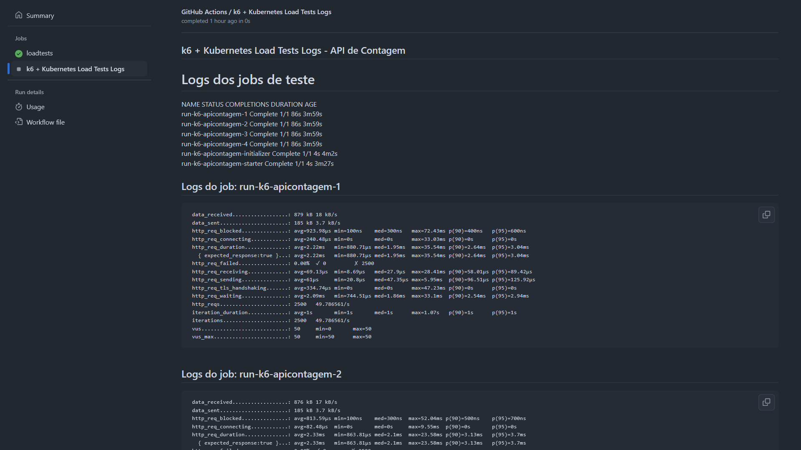

# k6-kubernetes_operator-githubactions-loadtests_http
Exemplo de implementação de testes de carga com k6 a partir de um cluster Kubernetes, através do uso do k6 Operator e um pipeline do GitHub Actions.

Live em que este exemplo foi apresentado (Canal .NET): https://www.youtube.com/watch?v=05zt0V6QzWQ

## Configuração no Kubernetes

Foi realizado o deployment do Operator do k6 via Helm:

```bash
helm repo add grafana https://grafana.github.io/helm-charts
helm repo update
helm install k6-operator grafana/k6-operator
```

Referências:
- [Install k6 Operator | Grafana k6](https://grafana.com/docs/k6/latest/set-up/set-up-distributed-k6/install-k6-operator/)
- [Running distributed tests | Grafana k6](https://grafana.com/docs/k6/latest/testing-guides/running-distributed-tests/)

## Workflow

Um resultado da execução do workflow do GitHub Actions:

